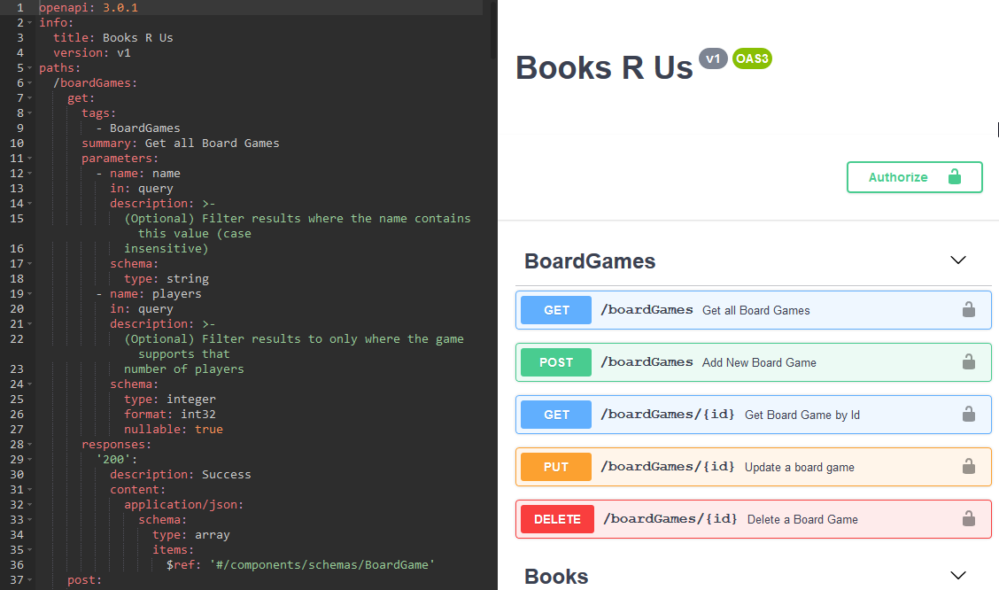

# Adding API Documentation

There are many ways of adding API documentation, but it needs to be accessible to your clients, either internal or external, so they can use the API successfully and efficiently.

This could be as document that is distributed or can be an online resource.

Currently one of the most popular is the [OpenAPI specification](https://swagger.io/specification/), which is an document, in yml or json, that describes each endpoint in the API. Usually exposed as part of the API itself.

***Important:** The OpenAPI Specification is totally independant of architecture, so useful for any API.*

Originally developed my Microsoft, many API frameworks now also support plugins for Swagger UI.

Swagger UI is a webpage that uses the OpenAPI document to make it more human readable, but also allows interaction with the API as well:



Creating OpenAPI documentation can be split into two stages:

1. Create an OpenAPI specification document
2. Create UI for users based on the OpenAPI specification document *(Optional)*

## Swagger Editor

The image above shows the [Swagger Editor](https://editor.swagger.io/) that is brillant for creating OpenAPI docs from scratch and even has tools to generate the actual API itself!.

You dont have to use it, it is after all just text, but it can help you as it even gives warnings.

***NB:** You can use the menu bar 'Edit > Convert to YAML' option if you paste JSON onto the page.*

## Specification

There are way to many parts to an OpenAPI document to cover here, I recommend you use the [OpenAPI specification](https://swagger.io/specification/) guide to cover it.

I recommend you look at the [./openapi.json](./openapi.json) document in the Swagger Editor to see how it relates to what is displayed.

To start you off though there are a couple of top level properties that are useful for helping your understanding.

`info` is basic information about the API itself, such as a name.

`paths` is a list of each of the url paths that can be matched in your API and they contain a node for each HTTP Method it supports e.g. GET. You then state the parameters it will except and the possible responses it will return.

`components` has many sub properties, the most important is probably `schemas`. If an endpoint accepts or returns a complex object then we declare them under `schemas` with a name and describe their structure and then reference that schema in various points under `paths`.

## Automated OpenAPI Document Generation

We will be using a pre-generated OpenAPI document manually in this guide and then using Swagger UI to display it.

However creating documentation like this can be time consuming, in languages like **C#** and **Java** (and a lesser extent TypeScript) there are plugins available to read the API and create a document using Classes and comments. In **JavaScript** this is not as easy to do, due to the nature of the language.

One advantage to having the documentation generated from code comments is it is co-located, making it harder to be missed when an API is changed.

There is a library that allow you to co-location your specification in a JavaScript application the [swagger-jsdoc](https://github.com/Surnet/swagger-jsdoc) library. It does still require you using the yml version of the OpenAPI Specification however, just next to the end point itself, not in a separate document.

See [this](./adding-api-docs-jsdoc.md) guide if you want to know how to use it.

## 1. Create Specification Document

We will reference this document when setting up the Swagger UI.

- Copy the [./openapi.json](./openapi.json) file into `src/openapi.json` in your application

## 2. Add UI

To display the documentation in a human readable format we can use [swagger-ui-express](https://github.com/scottie1984/swagger-ui-express) to create a front end to display the OpenApi document, and even interact with it.


- Install the `swagger-ui-express` library:
  ```cmd
  npm i swagger-ui-express
  ```

- Create `src/routes/documentation.js`
 ```js
 const swaggerUi = require('swagger-ui-express');
 const openApiDocument = require('../openapi.json');

 export default [
 	swaggerUi.serve,
 	swaggerUi.setup(openApiDocument)
 ];
 ```

In the example above we imported the openapi json file you created manually and passed it to `swagger-ui-express`.

We then need to link it with the app.

```js
import app from "./app";
import books from './routers/books';
import boardGames from './routers/boardGames';
import documentation from './routers/documentation';

app.use('/books', books);
app.use('/boardgames', boardGames);
app.use('/', documentation);
```

## TODO

- Open the openapi.json document in the Swagger Editor.
  - Check the end points match your own.
  - Fix any differences using the [OpenAPI specification](https://swagger.io/specification/) ask for help if needed.
- Follow the steps in `1. Create Specification Document` and `2. Add UI`.
- Try using the Swagger UI interactively to get books and board games.
