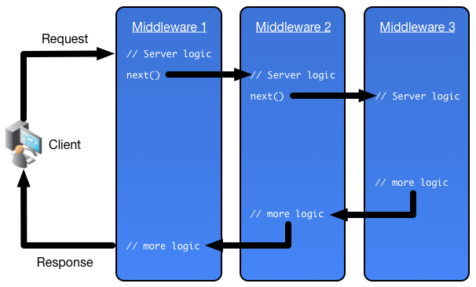

# What is Middleware?

Middleware is used in many systems and many frameworks, from ASP.Net Core to Redux to Express.

They all work in a similar way, a piece of code is added to a the 'middle' of a pipeline of code. Each middleware would have consistent shape of inputs and output, so they can easily be dropped in as the developer requires. The middleware can either perform external tasks (e.g. logging) or can manipulate the data being used in the pipeline (e.g. authorisation checking).



In this image you can see as a request comes in it hits the first middleware in the pipeline, that does an action, then calls `next` which runs the next middleware. This continues until next is no longer called and the calls start going back to the previous middleware before being returned.

## Express Middleware

In this tutorial we will look purely at Express's middleware.

So far you should have created a couple of route endpoints. E.g. `/health-check` where you handled a web request and used the response object from the pipeline to respond with a message. All endpoints are checked against the url and then only run if they match.

If we had wanted to add logging to all requests we could simply adding logging as middleware in this chain.


### Middleware vs Route Handlers

In the diagram above youll notice there is only middleware, so where are our route handlers?

Below is a route handler and a globally added middleware:

```js
app.get('/something/:id', (req, res, next) => {
	// route handler...
});

app.use((req, res, next) => {
	// middleware...
});
```

If you look at the function passed in they look the same... that is because they are. A route handler is in fact just middleware where you would not call the `next()` function. So its often omitted when you make a route handler.

### Using Middleware

In the example above we are adding a global middleware that will be run on every single request.

However it is possible to add middleware at the route level too, so it is only run on that route (when it matches the url).


```js
const timestampMiddleware = (req, res, next) => {
	const date = new Date();
	console.log(date.toISOString());
	next();
};

app.get('/something/:id', timestampMiddleware, (req, res, next) => {
	// route handler...
});
```

When the `/something/someId` url is requested a timestamp will be placed on the console. Yes this is almost pointless but does show how a simple middleware can be added selectively.

### Multiple Route Middleware

The get/post/put/delete/patch functions are more versatile than first appears. It can accept any number of middleware.

```js
app.get('/something', middleware1, middleware2, middleware3, (req, res, next) => {
	// route handler...
});
```

But also if you have several middleware that often go together it even accepts an array of middleware!

```js
const arrayOfMiddleware = [middleware1, middleware2, middleware3];

app.get('/something', arrayOfMiddleware, (req, res, next) => {
	// route handler...
});
```

### Adding Data to Pipeline

Some middleware needs to perform an action that will update the request so that other middleware and the route handlers are able to access it. The most obvious example of that is Authorisation middlware.

In Authorisation/Authentication middleware a check is done on the request that the person (or client) making the request is allowed to see use it. The knock on effect of that is we can create a `user` for the routes etc to use.

```js
app.use((req, res, next) => {
	const user = await doAuthCheck(req.headers['Authorization']);

	// If a user is returned we can assign them to the request to be used later
	if(user) {
		req.user = user;
		next();
		return;
	}

	res.status(401).send('You need to be authenticated to do that');
});

app.get('/', (req, res) => {
	res.send(`Hello ${user.name}`);
})
```

**Ordering is important for middleware.**

### References

- https://expressjs.com/en/guide/using-middleware.html
- https://expressjs.com/en/guide/writing-middleware.html